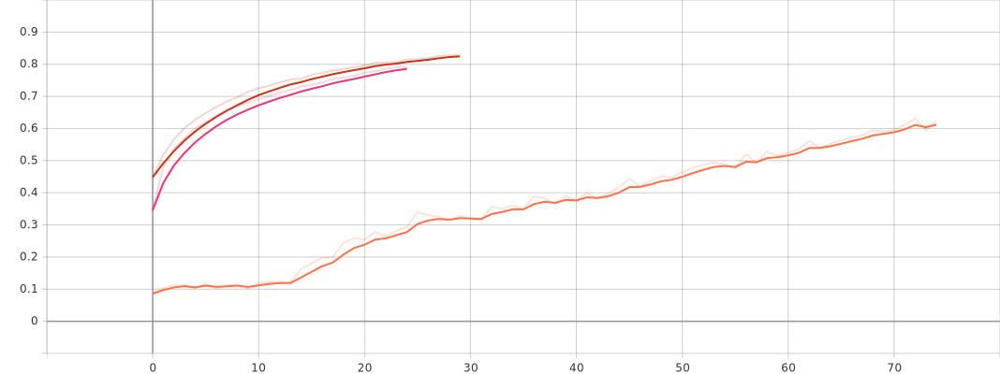
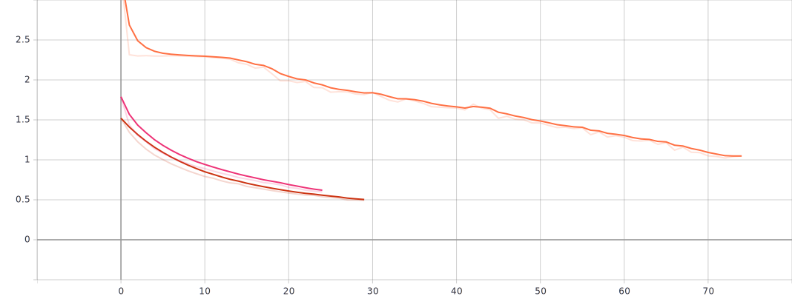
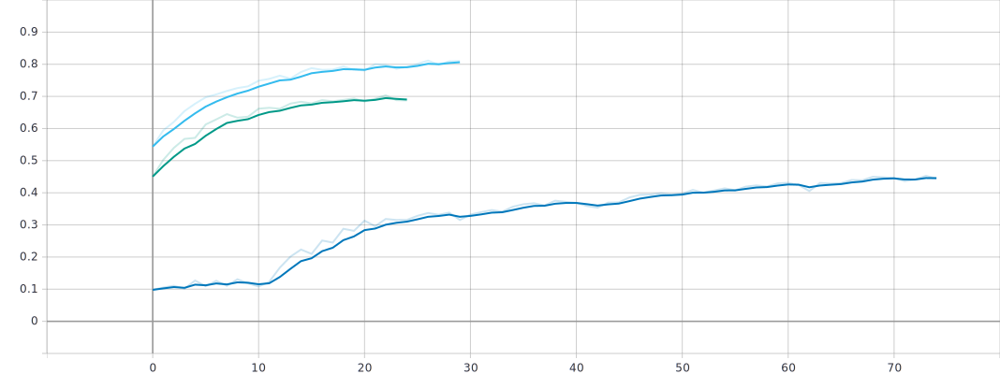
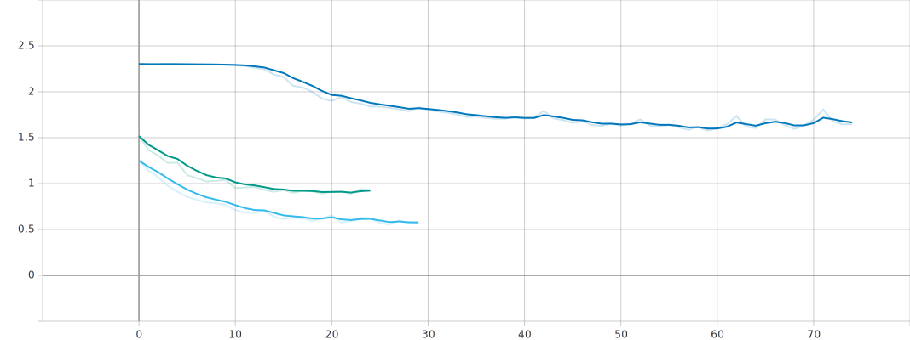

# Cifar10-Tensorflow
Tensorflow kütüphanesi ile Konvolüsyonel Sinir Ağı(Convolutional Neural Network) kodlanmasını ve yapının CIFAR10 veri seti ile eğitilmesini gösterdik. Aynı zamanda CNN mimarisinde başarıyı doğrudan etkileyen birkaç parametrenin sonuçlarını gözlemleyip, elde ettiğim sonuçlara ait karşılaştırmalı plotları ve bu plotlara ait yorumlarımı ekledik. Farklı hiper parametrelerin sonuca olan etkisini denemek adına küçük bir deneysel ağ oluşturduk. Yapılan her bir adım ve sonuçlarını yorum olarak Jupyter dosyasında açıkladık.

Testler | Sonuçlar
------------ | -------------
Doğruluk (accuracy): | 0.81
Keskinlik (precision): | 0.81
Duyarlılık (recall): | 0.81
f1 skoru: | 0.81 

## Train Doğruluğu

## Train Kaybı

## Validasyon Doğruluğu

## Validasyon Kaybı

